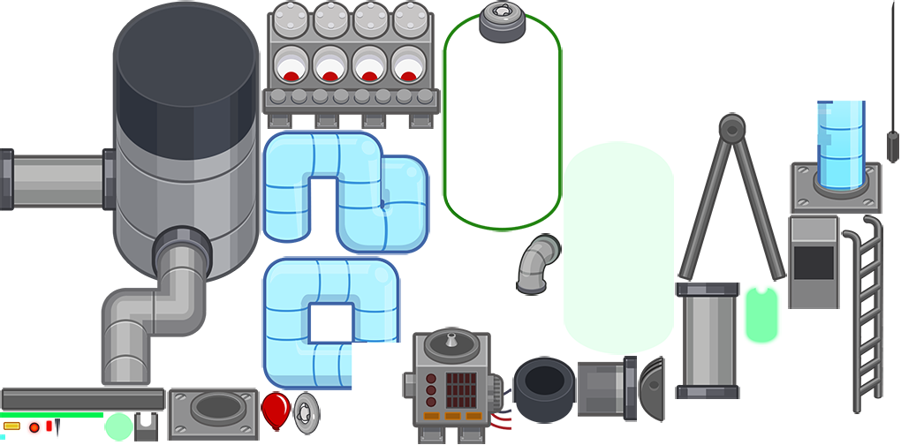
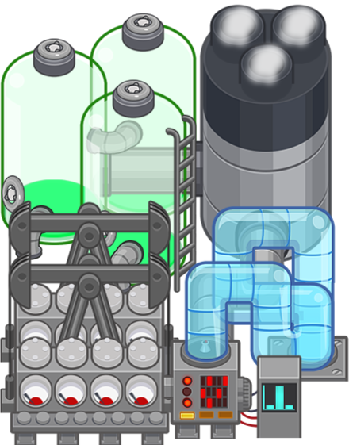

# NewFrameworkSpriteExporter

NewFrameworkSpriteExporter is a tool for rendering sprites from games made in ```NewFramework``` (what seems to be the name of the proprietary framework used in several games developed by Ninja Kiwi Europe, such as Bloons TD 5 and SAS: Zombie Assault 4) and exporting frames as images. These sprites are composed of cells loaded from one or more texture atlases and combined with different positions, scaling, rotation, and other modifiers specified using one or more JSON files.

This tool is a fan project and is not affiliated with Ninja Kiwi. This tool does not provide access to assets that are normally password-protected in the original game files; those must be extracted through some other means for this tool to work.

This tool is a work in progress and has not been thoroughly tested on every possible sprite. This tool was created by black box testing of NewFramework sprites; due to a lack of official documentation of their proprietary format and rendering pipeline, this may have inaccuracies and may not support all features.

Made in .NET Framework 9.0 in Visual Studio 2022. All image manipulation is powered by Magick.NET.


Texture atlas

Rendered sprite

## Usage
When you open the program, it displays a GUI. To render a sprite, first choose a destination for the following three specifications:
* Select the sprite (JSON file) you want to render. Note that any child sprites need to be in the same directory as the selected file.
* Select the folder where the texture atlas(es) are. This folder should contain all required texture atlasas and their corresponding XML files defining the bounds of each cell of the sprite.
* Select the folder to output the rendered images in.

Once all three are set up, simply press "render single frame" to render the first frame of the sprite, or "render animation" to render every frame of the animation. Each completed frame is displayed in a preview window on the right.

### Render options
* "Allow non-integer actor positioning" - Allows the positions of actors (components of the sprite) to interpolate to non-integer coordinates using ImageMagick's distortion feature. This is slower, but more accurate to how sprite position interpolation looks in-game.
* "Ignore actor dimensions" - Ignores the properties ```ax```, ```ay```, ```aw```, and ```ah``` in each cell. Intended for certain sprites in SAS4 that have a lot of unnecessary padding.
* "Ignore stage length" - Ignores the ```stageLength``` property of the selected sprite and only renders as many frames as are used by actor timelines within the sprite. Intended for sprites that use the default ```stageLength``` of 20 seconds when the actual animation is not that long. Note that while it does not factor in the ```stageLength``` in determining the overall length of the animation, it is still used when determining the duration before an animation loops for any child sprites.
